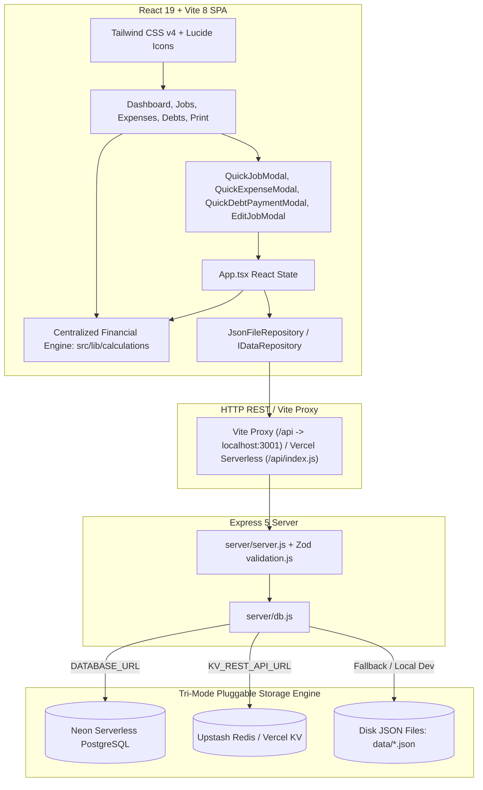

# myManager — Comprehensive Architecture Audit & Project Memory
**Document Version:** 1.0.0  
**Generated:** September 2026  
**Repository Source of Truth:** `myManager`

---

## Executive Summary
This document serves as the permanent architectural memory and baseline technical audit of **myManager**. It reflects the actual, verified codebase inspected on disk—including every database driver, API endpoint, schema validator, React component, calculation engine module, and test suite.

The system is currently titled **"Artisan Cash (Moroccan Handyman Decision-Support System)"**, built specifically for technical trades (CCTV, IT, networking, electronics repair, TV/printer repair, satellite systems). It is designed to track financial truth (Available Cash, Net Business Profit, Outflows, Debt Obligations, and Uncollected Revenue) with rapid field-entry (<10s, <15s, <20s).

---

## 1. Current Architecture

### Layer Details:
1. **Frontend:**
   - **Framework:** React 19.2.8 (`react`, `react-dom`) + TypeScript 6.0 (`strict: true`)
   - **Bundler:** Vite 8.2.0 with `@vitejs/plugin-react`
   - **Styling:** Tailwind CSS 4.3.3 (`@tailwindcss/postcss`, `postcss`, `autoprefixer`)
   - **Charts:** Recharts 3.10.1 (ResponsiveContainer, PieChart, LineChart)
   - **Icons:** Lucide-React 1.32.0
   - **Linter & Test:** Oxlint 1.75.0, Vitest 4.1.11

2. **State Management:**
   - Single top-level state container in `src/App.tsx`.
   - Entities (`jobs`, `jobPayments`, `jobInterventions`, `businessExpenses`, `personalExpenses`, `debts`, `debtPayments`, `clients`) are loaded via `Promise.all` on mount and re-fetched after mutations (`loadData()`).
   - Pure derived state: `FinancialMetrics`, `FactualInsight[]`, and `DataHealthReport` are calculated synchronously on every render from raw state arrays via `/src/lib/calculations/`.

3. **Authentication:**
   - Client-side gate via `src/components/auth/LoginModal.tsx`.
   - Hardcoded check: Username `AMINEAK` (case-insensitive) and Password `+Thugstools1?`.
   - Persisted in `localStorage` under `handyman_authenticated = 'true'`.

4. **Storage Abstraction:**
   - Interface `IDataRepository` in `src/lib/storage/repository.ts`.
   - Single implementation `JsonFileRepository` in `src/lib/storage/jsonFileRepository.ts` issuing raw `fetch('/api/...')` calls to the Express backend.

5. **Backend & Deployment:**
   - `server/server.js`: Express 5 server with CORS and JSON body-parser (10MB limit).
   - `api/index.js`: Default export exporting the Express app for Vercel Serverless Function rewrites defined in `vercel.json` (`/api/(.*) -> /api/index.js`).
   - Diagnostics endpoint: `GET /api/health` returns active backend mode (`postgres`, `redis`, or `json-file`), persistence flag, and record counts.

---

## 2. Current Data Model & Database Architecture

The backend in `server/db.js` dynamically selects one of three storage engines:
1. **Neon PostgreSQL** (`@neondatabase/serverless`): Activated if `DATABASE_URL` or `POSTGRES_URL` is set.
2. **Upstash Redis / Vercel KV** (`@upstash/redis`): Activated if `KV_REST_API_URL` or `UPSTASH_REDIS_REST_URL` is set.
3. **Local JSON Files** (`data/*.json`): Activated as fallback when no cloud database connection strings are present.

### Database Tables / Collections:

| Entity | Table (Postgres) / Key (Redis) / JSON File | Key Fields & Constraints | Description |
| :--- | :--- | :--- | :--- |
| **Job** | `jobs` / `jobs.json` | `id` (PK), `title`, `client_name`, `client_phone`, `category`, `status`, `agreed_price`, `paid_amount`, `material_costs`, `start_date`, `completed_date`, `acquisition_source`, `waiting_reason`, `days_spent`, `days_paused`, `logs` (JSONB) | Primary job record with embedded activity timeline logs. |
| **JobPayment** | `job_payments` / `job_payments.json` | `id` (PK), `job_id` (FK), `amount`, `date`, `notes` | Cash actually received on a specific date for a job. |
| **JobIntervention** | `job_interventions` / `job_interventions.json` | `id` (PK), `job_id` (FK), `date`, `reason`, `resolved`, `resolved_date`, `hours_spent`, `notes` | Post-completion client callback / warranty visit. |
| **BusinessExpense** | `business_expenses` / `business_expenses.json` | `id` (PK), `title`, `amount`, `category`, `date`, `job_id`, `notes` | Work-related overhead (tools, fuel, supplies, workshop, permits). |
| **PersonalExpense** | `personal_expenses` / `personal_expenses.json` | `id` (PK), `title`, `amount`, `category`, `date`, `notes` | Household (family) vs Individual (personal pocket) spending. |
| **DebtObligation** | `debts` / `debts.json` | `id` (PK), `creditor`, `type`, `total_amount`, `remaining_balance`, `monthly_min_payment`, `due_date`, `status`, `notes` | Loans, supplier credit lines, equipment financing. |
| **DebtPayment** | `debt_payments` / `debt_payments.json` | `id` (PK), `debt_id` (FK), `amount`, `date`, `notes` | Cash paid toward an active debt obligation. |
| **Client** | `clients` / `clients.json` | `id` (PK), `name`, `phone`, `city`, `acquisition_source`, `notes` | Client directory auto-populated on job creation. |

### Data Integrity Safeguards Already Implemented:
- **`DeleteBlockedError` (`HAS_DEPENDENTS`):** Neither a job nor a debt can be deleted if payments or client callbacks are attached to it. The system throws a conflict error with exact details.
- **Foreign Keys (`ON DELETE RESTRICT`):** Added in Neon Postgres (`fk_job_payments_job_id`, `fk_job_interventions_job_id`, `fk_debt_payments_debt_id`).
- **Atomic Payment Collection:** In `collectJobPaymentDb`, the payment insertion and the recomputation of `jobs.paid_amount = LEAST(agreed_price, SUM(job_payments))` occurs inside a single SQL transaction.
- **Atomic Debt Payment:** In `saveDebtPaymentDb`, recording a debt payment and recomputing `debts.remaining_balance = GREATEST(0, total_amount - SUM(debt_payments))` occurs inside a single transaction.
- **Data Health Verification:** `dataHealth.ts` scans in real-time for paid amount mismatches, overpayments, orphaned payments/interventions, balance drift, and duplicate client records.

---

## 3. Current Calculation Architecture

All mathematical and analytical formulas reside under `src/lib/calculations/`. UI components are strictly forbidden from recalculating business metrics manually:

1. **Cashflow & Available Cash (`cashflow.ts`):**
   - `Collected Income = SUM(job.paidAmount)`
   - `Total Revenue Agreed = SUM(job.agreedPrice)`
   - `Uncollected Revenue = SUM(MAX(0, agreedPrice - paidAmount))`
   - `Direct Job Costs = SUM(job.materialCosts)`
   - `Business Overhead = SUM(businessExpenses.amount)`
   - `Total Business Costs = Direct Job Costs + Business Overhead`
   - `Total Personal Spending = SUM(personalExpenses.amount)`
   - `Total Debt Paid = SUM(debtPayments.amount)`
   - **Available Cash Position:** `Collected Income - Total Business Costs - Total Personal Spending - Total Debt Paid`
2. **Profitability (`profitability.ts`):**
   - `Net Business Profit = Collected Income - Total Business Costs`
   - `Profit Margin % = (Net Business Profit / Collected Income) * 100`
3. **Debt Metrics (`debt.ts`):**
   - `Total Debt Outstanding = SUM(active debts remainingBalance)`
   - `Monthly Debt Commitments = SUM(active debts monthlyMinPayment)`
4. **Job Timing & Labor (`jobTiming.ts`):**
   - `computeJobDurations`: Derives calendar `daysSpent` and `daysPaused` from activity logs.
   - `calculateJobTotalHours`: Aggregates logged work hours from `job.logs` + `jobInterventions.hoursSpent`.
5. **Acquisition Funnel (`acquisition.ts`):**
   - Aggregates agreed revenue and collected cash grouped by `acquisitionSource` (e.g., Droguerie, Business Card, Mustapha Alliance, Mestour).
6. **Household vs Individual Split (`personalExpenseScope.ts`):**
   - Categorizes spending into shared household (rent, groceries, utilities, healthcare) vs individual discretionary (café, gaming, pocket money).
7. **Weekly Spending & Reward Tracker (`weeklyTracker.ts`):**
   - Computes daily spending points for the selected week and calculates `netWeeklySurplus = MAX(0, totalWeeklyIncome - totalWeeklySpent)` as an economic reward.
8. **Objective Factual Insights (`insights.ts`):**
   - Generates non-emotional, data-driven alerts for client revision requests, paused jobs waiting for parts, uncollected cash, debt coverage shortfalls, profit margin rate, quote conversion rate, and open callback visits.

---

## 4. Current UI & Quick Entry Architecture

- **Header / Persistent Ticker (`HeaderNav.tsx`):**
  - Displays real-time `Available Cash`, `Net Profit`, `Uncollected Revenue`, session lock, and tabs.
  - Native mobile bottom navigation bar for one-hand operation.
- **Rapid Actions (<10s, <15s, <20s):**
  - **Quick Job Entry (`QuickJobModal.tsx`):** Pre-populates category, client quick-pick pills, lead source chips, agreed price, cash received, material costs, and hours.
  - **Quick Expense (`QuickExpenseModal.tsx`):** Strict Work vs Personal toggle, quick numeric amount chips (+10, +20, +50, +100, +200, +500 MAD), and one-tap presets (Café 15 MAD, Gaming 50 MAD, Groceries 100 MAD, Recharge 20 MAD).
  - **Quick Debt Payment (`QuickDebtPaymentModal.tsx`):** Creditor selection, remaining balance display, and 1-tap fill of monthly minimum payment.
  - **1-Tap Collect Payment in Jobs View (`JobsView.tsx`):** Collects cash and automatically marks job as paid if the balance is satisfied.
- **Print & Audit View (`PrintStatementView.tsx`):**
  - Formal printable statement, CSV export generator, complete JSON backup export/import, and data integrity health monitor.

---

## 5. Architectural Gaps vs. Master Vision

While the existing system has strong financial modeling and data integrity, key capabilities are needed to fulfill the master vision:

| Feature Dimension | Existing Implementation | Target Evolution |
| :--- | :--- | :--- |
| **Offline Capability** | Fails when offline (raw `fetch` calls throw in `JsonFileRepository`). | **Local-First with IndexedDB**: App opens and performs all reads/writes locally in IndexedDB with an offline synchronization queue. |
| **Progressive Web App** | Standard web application; no service worker or manifest. | **Installable PWA**: Service worker caching app shell, web manifest, offline startup. |
| **Economic Time & Hourly Rate** | Days elapsed derived from logs; basic manual labor hours. | **Effective Hourly Rate (EHR)** = Net Profit / Total Economic Time (Hands-on + Diagnostic + Travel + Waiting + Rework). |
| **Travel Economics** | Lumped into general fuel/transport expenses. | Structured travel tracking: `distanceKm`, `travelTimeMinutes`, `travelCost`, `transportType`, `profitPerKm`. |
| **Delay Taxonomy** | Freeform text logs with status `waiting_parts`. | Structured delay tags: `MISSING_TOOL`, `SITE_UNPREPARED`, `CLIENT_DELAY`, `TECHNICAL_COMPLICATION`, etc. |
| **Field Execution Mode** | Static forms with modal dialogs. | Persistent field timer surviving app reload, quick delay logging, Web Speech voice notes. |
| **Gamification Engine** | Weekly cash savings surplus only. | Deterministic XP engine, immutable XP event ledger, technician progression levels (Apprentice -> Expert), meaningful activity streak. |
| **Business Intelligence** | Lead source funnel, cash outflow chart. | Job profitability matrix (by job type and confidence level), dynamic preventative checklist engine with frequency/recency learning. |
| **Technical Knowledge Base** | Freeform notes and reasons on callbacks. | Structured `TechnicalIssue`: symptom, cause, solution, equipment brand, and model. |

---

## 6. Migration & Safe Evolution Strategy

1. **Preserve Existing Backends & Cloud DBs:**
   - The tri-mode backend (`server/db.js`) with Neon Postgres and Upstash Redis is fully functional and free-tier compatible.
   - We **do not discard or replace** this backend. Instead, we insert an IndexedDB layer on the client and connect it to the existing API via an offline sync queue.
2. **Backward-Compatible Type Extensions:**
   - Extend `Job` and `JobIntervention` in `src/types/index.ts` with optional fields (`estimatedHours`, `actualHours`, `travelTimeMinutes`, `diagnosticTimeMinutes`, `waitingTimeMinutes`, `reworkTimeMinutes`, `distanceKm`, `travelCost`, `transportType`, `delays`).
   - Old database rows without these fields continue to load seamlessly without schema breakage.
3. **Repository Pattern Upgrade:**
   - The UI currently imports `jsonFileRepository as repository` in `App.tsx`.
   - By creating an `OfflineFirstRepository` that implements `IDataRepository` using IndexedDB + Sync Queue, `App.tsx` and all UI components gain offline capability without rewriting their component code.
4. **Data Loss Prevention:**
   - IndexedDB will hold local drafts and mutations.
   - When online, operations are replayed idempotently to `/api/...`.
   - Never use "silent last write wins" on critical financial records; maintain timestamped operational logs.

---

## 7. Project File Inventory

### Core Configuration
- `package.json`: Scripts (`dev`, `server`, `build`, `test`, `lint`), dependencies.
- `vite.config.ts`: Vite configuration with React plugin and `/api` proxy to `:3001`.
- `vercel.json`: Vercel serverless rewrite `/api/(.*) -> /api/index.js`.
- `tailwind.config.js` & `postcss.config.js`: Tailwind v4 setup.
- `tsconfig.json`, `tsconfig.app.json`, `tsconfig.node.json`: Strict TypeScript configurations.

### Server & API Layer
- `server/server.js`: Express server endpoints for jobs, payments, interventions, expenses, debts, export/import.
- `server/db.js`: Tri-mode storage driver (Neon Postgres, Upstash Redis, JSON files).
- `server/validation.js`: Server-side Zod validation schemas.
- `api/index.js`: Vercel serverless bridge.
- `data/`: Local JSON files (`jobs.json`, `job_payments.json`, `job_interventions.json`, `business_expenses.json`, `personal_expenses.json`, `debts.json`, `debt_payments.json`, `clients.json`).

### Client Source Layer (`src/`)
- `src/main.tsx` & `src/App.tsx`: Root application lifecycle and master state.
- `src/types/index.ts`: Domain types and interfaces.
- `src/lib/jobOptions.ts`: Job categories and default acquisition sources.
- `src/lib/storage/repository.ts`: `IDataRepository` interface.
- `src/lib/storage/jsonFileRepository.ts`: HTTP fetch repository implementation.
- `src/lib/calculations/`:
  - `index.ts`: Master export & `computeFinancialMetrics()`.
  - `cashflow.ts`: Cash in/out, available cash, business overhead, personal spending.
  - `profitability.ts`: Net profit & profit margin.
  - `debt.ts`: Outstanding balance & monthly debt commitments.
  - `jobTiming.ts`: Calendar duration & total labor hours.
  - `interventions.ts`: Post-completion callbacks summary.
  - `acquisition.ts`: Client acquisition source ROI analysis.
  - `personalExpenseScope.ts`: Household vs individual spending categorization.
  - `weeklyTracker.ts`: Weekly spending & savings surplus tracker.
  - `dataHealth.ts`: Data integrity & ledger reconciliation checks.
  - `insights.ts`: Factual insight generator.
  - `__tests__/`: Comprehensive Vitest unit tests for each module.
- `src/components/`:
  - `auth/LoginModal.tsx`: Authentication gate.
  - `header/HeaderNav.tsx`: Top status ticker, tabs, mobile bottom navigation.
  - `dashboard/`: `DashboardView.tsx`, `AcquisitionFunnelCard.tsx`, `WeeklySpendingTrackerCard.tsx`.
  - `jobs/`: `JobsView.tsx`, `EditJobModal.tsx`.
  - `expenses/`: `ExpensesView.tsx`.
  - `debt/`: `DebtView.tsx`.
  - `export/`: `PrintStatementView.tsx`.
  - `quickEntry/`: `QuickJobModal.tsx`, `QuickExpenseModal.tsx`, `QuickDebtPaymentModal.tsx`.
